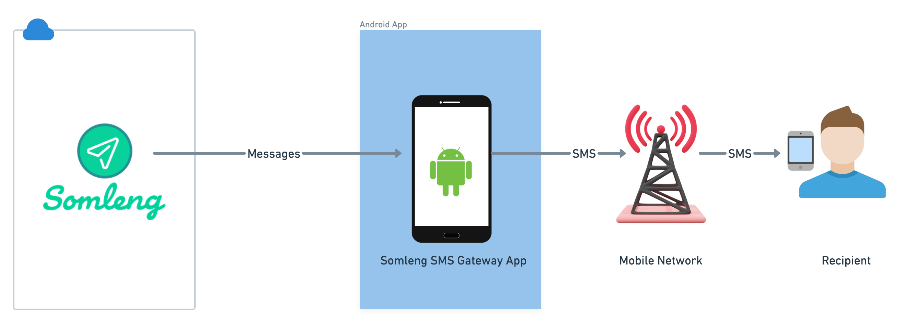

# Somleng SMS Gateway App

Transform your Android smartphone into a powerful SMS gateway with the Somleng SMS Gateway App. This lightweight, modern application seamlessly connects to the [Somleng](https://www.somleng.org/) platform, enabling you to send SMS messages programmatically via API or CLI tools, and receive webhooks for incoming SMS messages. Perfect for developers and businesses looking to integrate SMS functionality into their applications and services.

  

The app acts as a bridge between the Somleng platform and your mobile network, allowing you to leverage your device's SMS capabilities for automated messaging workflows.

  

## Documentation

- [Installation Guide](docs/installation.md)
- [Usage Guide](docs/usage.md)

## License

The software is available as open source under the terms of the [MIT License](http://opensource.org/licenses/MIT).

## 🙏 Acknowledgments

- Built with ❤️ by the [Somleng](https://www.somleng.org/) team
- Thanks to all contributors and community members
