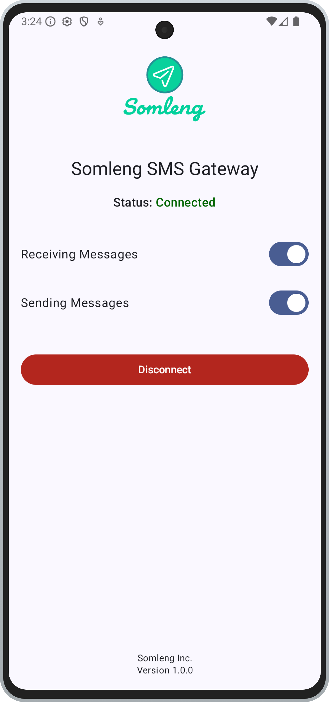

# Somleng SMS Gateway App

Transform your Android smartphone into a powerful SMS gateway with the Somleng SMS Gateway App. This lightweight, modern application seamlessly connects to the [Somleng](https://www.somleng.org/) platform, enabling you to send SMS messages programmatically via API or CLI tools, and receive webhooks for incoming SMS messages. Perfect for developers and businesses looking to integrate SMS functionality into their applications and services.

  

The app acts as a bridge between the Somleng platform and your mobile network, allowing you to leverage your device's SMS capabilities for automated messaging workflows.

  

## 📖 Usage

### Initial Setup
1. **Launch the App**: Open the Somleng SMS Gateway app on your device
2. **Enter Device Key**: Input your device key from the Somleng dashboard
3. **Connect**: Tap "Connect" to establish connection with the Somleng platform
4. **Grant Permissions**: Allow SMS permissions when prompted

### Managing SMS Gateway
Once connected, you can:
- **Toggle Receiving**: Enable/disable incoming SMS processing
- **Toggle Sending**: Enable/disable outgoing SMS functionality
- **Monitor Status**: View real-time connection status
- **Disconnect**: Safely disconnect from the platform

### Finding Your Device Key
1. Log into your account on Somleng.
2. Navigate to SMS Gateways
3. Create a new gateway or select an existing one
4. Copy the device key for use in the app

## ⚙️ Environment Configuration

The Android module now defines dedicated product flavors for `dev`, `staging`, and `production`. Each flavor can maintain its own Firebase configuration, network security rules, resources, and URLs.

- **Flavor selection**: Use the *Build Variants* panel in Android Studio and choose among `devDebug`, `stagingRelease`, etc., or call Gradle tasks such as `./gradlew assembleDevDebug`.
- **Firebase**: Place a `google-services.json` file inside `app/src/<flavor>/` (for example `app/src/dev/google-services.json`). Each flavor must have its own file before you can build or publish that variant.
- **Somleng endpoint**: Update `app/src/<flavor>/res/values/config.xml` with the websocket URL that corresponds to the environment.
- **Network security**: Adjust `app/src/<flavor>/res/xml/network_security_config.xml` if the allowed domains or cleartext requirements differ between environments.
- **Runtime flag**: Access `BuildConfig.ENVIRONMENT` in Kotlin if you need to branch on the active flavor at runtime.
- **Default variant**: The `dev` flavor is marked as the default, so Android Studio will select `devDebug` for fresh checkouts unless you pick a different build variant.

## License

The software is available as open source under the terms of the [MIT License](http://opensource.org/licenses/MIT).

## 🙏 Acknowledgments

- Built with ❤️ by the [Somleng](https://www.somleng.org/) team
- Thanks to all contributors and community members
