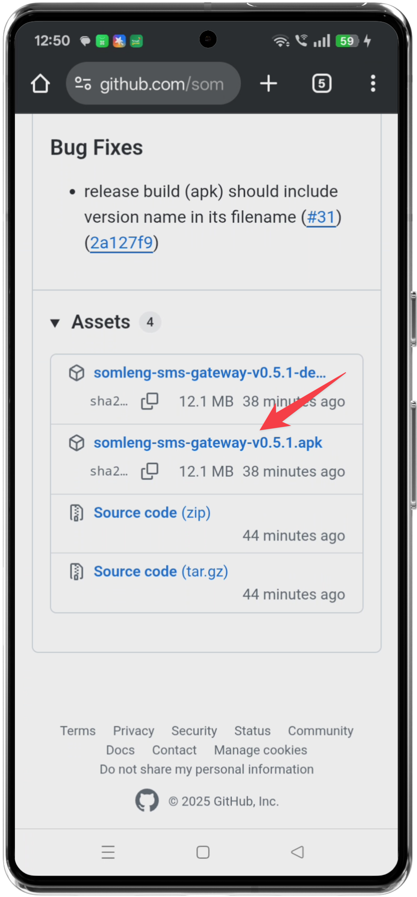
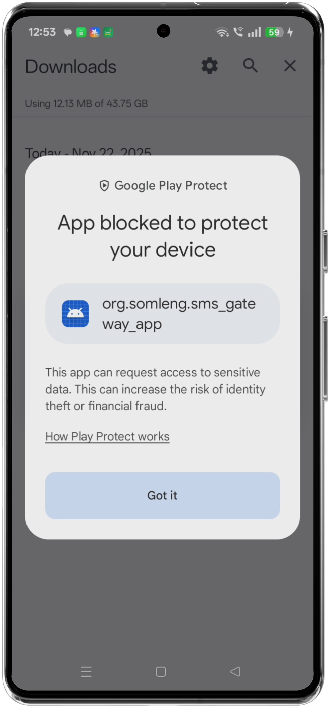
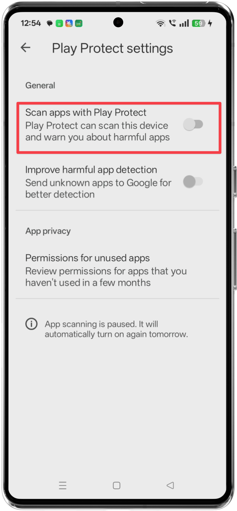
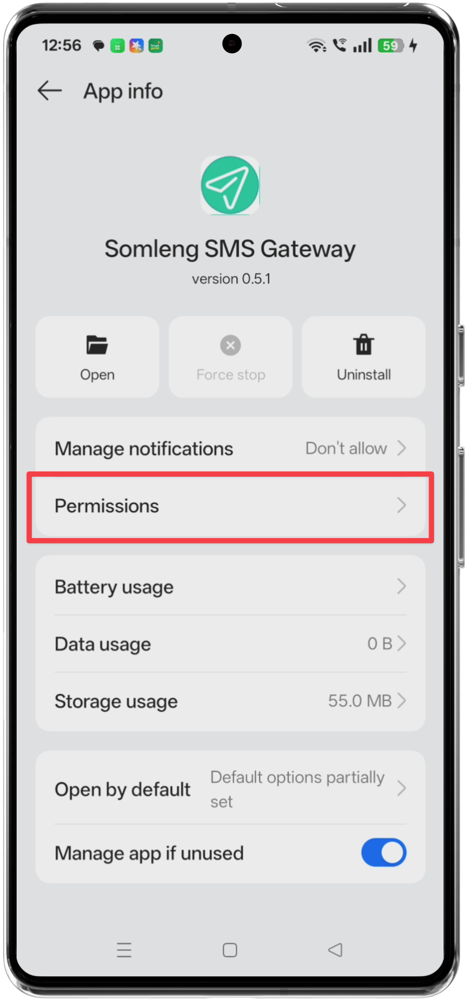

## SMS Gateway App Installation Guide

This document describes how to install and configure the SMS Gateway Android app. The app needs access to **restricted permissions** (in particular, SMS) so that it can reliably send and receive messages on behalf of your server. Because the app is distributed as an APK outside the Google Play Store, there are additional one-time steps required to allow installation and to grant the necessary permissions.

> **Important**: Only install this app on devices you control and trust. The app will be able to send and read SMS on the device once permissions are granted.

---

## 1. Download the latest APK

1. Open a browser on your Android device.
2. Navigate to the latest release of the SMS Gateway app on GitHub Releases: `https://github.com/somleng/sms-gateway-app/releases`.
3. In the latest release, download the Android APK asset to your device.

---

## 2. Understand Google Play Protect blocking behavior

By default, many Android devices use **Google Play Protect** to help block apps that are installed from outside the Play Store (sideloaded apps). As a result, you may see a warning or the installation may be blocked when you try to install the downloaded APK.

If you see a Play Protect screen indicating that the app is blocked, continue with the steps below to temporarily adjust Play Protect so you can complete the installation.

---

## 3. Open Play Protect settings

1. Open the **Google Play Store** app on your device.
2. Tap your profile icon (typically in the top right corner).
3. Tap **Play Protect** to open Play Protect.

---

## 4. Temporarily turn off Play Protect blocking

1. In the Play Protect screen, open the **settings** for Play Protect.
2. Temporarily turn off the option that blocks or scans apps downloaded from the internet (this may appear as "Scan apps with Play Protect" or similar wording on your device).
3. Confirm the change if prompted.

This temporary change allows your device to install the SMS Gateway APK that you downloaded from GitHub.

> **Recommendation**: After you have successfully installed and configured the SMS Gateway app, you can return to Play Protect settings and re-enable the protection options.

---

## 5. Install the APK and complete first-run permissions

1. Locate the downloaded APK file (usually in your **Downloads** folder) and tap it to start installation.
2. Follow the on-screen prompts to install the app.
3. After installation completes, **open the SMS Gateway app**.
4. When prompted, grant the requested permissions (e.g., SMS, notifications). These are required for the app to function correctly as an SMS gateway.

Once the initial permissions are granted, you will need to enable the restricted SMS permission in the system App Info settings (next sections).

---

## 6. Open App Info and allow restricted settings

1. On your device, go to **Settings → Apps** (or **App management**, depending on your device brand).
2. Find and select the **SMS Gateway** app.
3. In the app information screen, open **More settings** (this may be displayed as a menu icon or an "Advanced" section).
4. Tap **Allow restricted settings**.

Enabling restricted settings is required in order to grant the app access to restricted permissions like SMS.

---

## 7. Grant SMS permission

1. From the same App Info screen, tap **Permissions**.

2. Tap **SMS**.
3. Change the setting to **Allow**.

Granting SMS permission ensures the SMS Gateway app can send and receive SMS messages as required by your configuration.

---

## 8. Final checks

After you complete the steps above:

- **Re-enable Play Protect** (optional but recommended): Return to **Play Store → Play Protect settings** and turn protection options back on.
- **Verify connectivity**: Open the SMS Gateway app and confirm that it connects to your configured server/endpoint as expected.
- **Test SMS**: Send a test SMS through your backend or configured workflow to ensure messages are successfully sent and, if applicable, received.

If you encounter any issues during installation or configuration, double-check that:

- The APK was downloaded from the official GitHub Releases page (`https://github.com/somleng/sms-gateway-app/releases`).
- Play Protect did not silently re-block the app before installation finished.
- The app has **SMS → Allow** granted in the system App Info permissions.
- **Allow restricted settings** remains enabled for the app.

