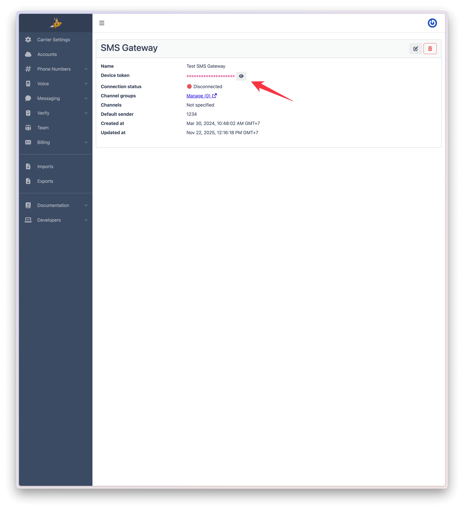
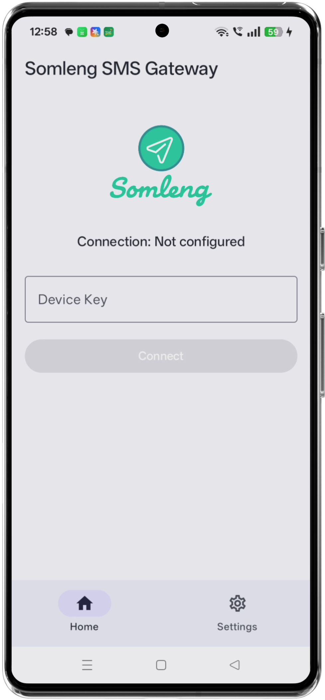
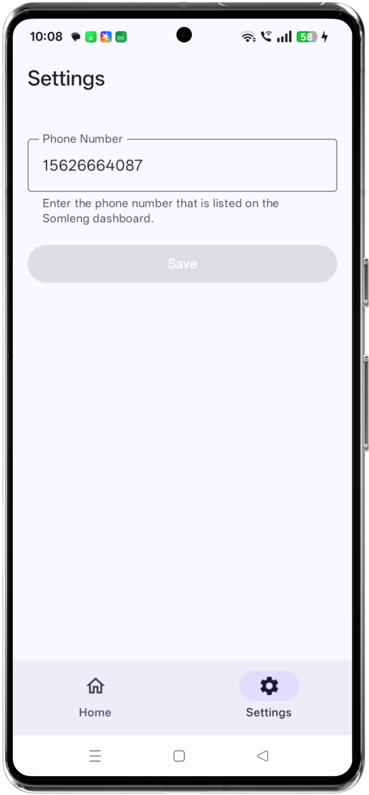

## Usage Guide

This guide explains how to use the SMS Gateway Android app after you have installed it on your device.

- **Before you start**: Complete all steps in the `SMS Gateway App Installation Guide` (`docs/installation.md`) and ensure the app has all required permissions, including **Allow restricted settings** and **SMS → Allow** in the system App Info.

---

## 1. Prerequisites

Before using the app:

1. Follow the installation steps in `docs/installation.md` to:
   - Download and install the APK from GitHub Releases.
   - Temporarily adjust **Play Protect** if needed.
   - Enable **Allow restricted settings** for the SMS Gateway app.
   - Grant the **SMS** permission (set to **Allow**).
2. Make sure you have access to your **Somleng Dashboard** and an existing **SMS Gateway** with a **Device Token**.

---

## 2. First launch and device token

When you first open the SMS Gateway app you will see a screen indicating that the app is **not yet configured** and prompting you to enter a **Device Token**. Go to copy the device token:

1. In your browser, sign in to the **Somleng Dashboard**.
2. Go to **Messaging → SMS Gateways**.
3. Select the SMS Gateway you created. On the details screen copy the **Device Token**.

   

4. Return to the SMS Gateway app on your Android device.
5. Paste or type the copied **Device Token** into the input field.
6. Tap the **Connect** button.

   

The app will attempt to connect to the Somleng platform using this device token.

---

## 3. Connection status

After you enter a valid device token and tap **Connect**:

1. The app will connect to Somleng using the configured device token.
2. If the connection is successful, the status at the top of the screen will show **Online**.

   

If the status does not change to **Online**, double‑check:

- That the device has an active internet connection.
- That the device token is copied correctly from the Somleng Dashboard.
- That all required permissions from the installation guide are granted.

---

## 4. Send and receive SMS options

On the main screen, you'll see two switches or toggles:

-   **Receive SMS**
-   **Send SMS**

These options determine whether the app handles SMS traffic while maintaining the gateway connection to Somleng.

-   **Receive SMS (disabled)**: The app remains connected to Somleng, but inbound SMS messages are not processed by the gateway for forwarding to Somleng.
-   **Send SMS (disabled)**: The app stays connected, but outbound SMS requests from Somleng are ignored, preventing the actual message from being sent to the recipient.

This is useful when you want to temporarily pause real SMS traffic without disconnecting the device from the Somleng platform.

---

## 5. Optional: Handle inbound SMS on this device

If you want this device to handle inbound SMS for a phone number managed by Somleng, you must:

1. **Configure a Phone Number in Somleng**
   Follow the Somleng documentation to create and configure a phone number for messaging:
   - Open the Somleng docs: [`SMS Gateway Configuration Guide – Create and configure a Phone Number`](https://www.somleng.org/docs.html#sms_gateway_configuration_guide_create_phone_number).
   - Create a **Phone Number** and link it to the relevant **Account**.
   - Configure the **Messaging** section (SMS URL, method, etc.) as described in the docs.

2. **Enter the phone number in the app settings**
   On your Android device:

   1. Open the **SMS Gateway** app.
   2. Go to the **Settings** screen.
   3. Enter the **phone number** that you registered in Somleng (in E.164 format, e.g. `+855...`).
   4. Save the settings.

   

With these steps completed, inbound SMS to that number will be handled by this device (subject to your Send/Receive settings and your Somleng configuration).

---

## 6. Testing

After the app is configured and shows **Online**:

1. **Test outbound SMS**
   - Use the Somleng Account API (as described in the Somleng docs) or your backend to send a message from your configured phone number.
   - Confirm that:
     - The SMS is sent from the Android device (you may see it in the device’s SMS app or logs).
     - The message appears under **Messages** in the Somleng Dashboard.

2. **Test inbound SMS**
   - From another phone, send an SMS to the number you configured in Somleng.
   - Confirm that:
     - The message is received by the device.
     - The SMS is visible in the Somleng Dashboard (and delivered to your SMS URL if configured).

If tests fail, verify:

- The app status is **Online**.
- **Send SMS** / **Receive SMS** toggles are enabled as required.
- The phone number in app settings exactly matches the one configured in Somleng.
- The device has a working mobile network connection and SMS plan.

